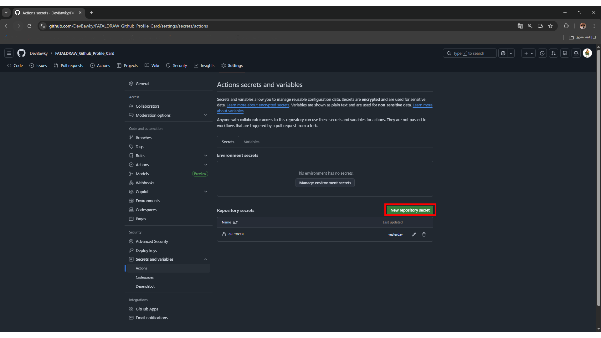

# 🤠 FATALDRAW Profile Card

<div align="center">
     
</div>

<details>
<summary>KOR</summary>

당신의 깃허브 활동 내역을 __`FATALDRAW식 현상수배 포스터`__ 스타일의 픽셀 아트로 만들어주는 액션입니다.<br>
커밋, 스타, PR 수에 따라 당신의 __`현상금(Bounty)`__ 이 책정되고, 그에 맞는 __`위험 등급(Rank)`__ 도장이 찍힙니다!

## 특징 (Features)
- __`현상금 시스템:`__ 활동량에 따라 현상금이 최대 **$99,999,999**까지 올라갑니다.
- __`등급 시스템:`__  현상금 액수에 따라 **S+** 부터 **D** 까지 등급이 매겨집니다.
- __`빈티지 효과:`__  종이 질감과 잉크 번짐 효과가 자동으로 적용됩니다.

- __`멀티 캐릭터:`__  `Juno`와 `Rosalyn` 중 원하는 캐릭터를 선택할 수 있습니다.

### 캐릭터 종류
| Juno | Rosalyn |
| ---- | ---- |
|  |  |


## Quick Start

복잡한 설정 없이 바로 적용해 보세요!

### 1단계: 워크플로우 파일 만들기
1. 본인의 리포지토리에서 `.github/workflows` 폴더로 이동합니다. (없으면 만드세요)
2. `profile-card.yml` 파일을 새로 만들고 아래 코드를 그대로 복사해 붙여넣습니다.

```yaml
name: FATALDRAW Profile Card

on:
  schedule:
    - cron: '0 0 * * *'
  workflow_dispatch:

jobs:
  build:
    runs-on: ubuntu-latest
    permissions:
      contents: write
    
    steps:
      - uses: actions/checkout@v3

      - name: Generate Wanted Poster
        uses: DevBawky/FATALDRAW_Github_Profile_Card@main
        with:
          username: ${{ github.repository_owner }}
          token: ${{ secrets.GITHUB_TOKEN }} # 비공개 커밋까지 합하려면 Configuration을 참고해주세요
          character: 'Juno' # Choose Character you want (Juno / Rosalyn)

      - name: Move to dist
        run: |
          mkdir -p dist
          mv stats.svg dist/

      - name: Push to Output Branch
        uses: crazy-max/ghaction-github-pages@v3
        with:
          target_branch: output
          build_dir: dist
          keep_history: true
        env:
          GITHUB_TOKEN: ${{ secrets.GITHUB_TOKEN }}
```

### 2. 적용 확인
1. 파일을 `Commit` 합니다.
2. 리포지토리 상단 __`[Actions]`__ 탭을 클릭합니다.
3. 왼쪽 메뉴에서 __`FATALDRAW Profile Card`__ 를 클릭하고, 오른쪽 __`Run workflow`__ 버튼을 눌러 수동으로 실행해줍니다.
4. 약 10초 후 초록색 체크가 뜨면 성공입니다!

### 3. 프로필(README.md)에 이미지 띄우기
이제 생성된 이미지를 본인의 __`프로필(README.md)`__ 에 붙여넣으세요!<br>
반드시 __`본인 아이디`__ 와 __`리포지토리명`__ 으로 __`src`__ 를 수정해야 합니다!!

```HTML
<div align="center">
  <a href="https://github.com/DevBawky/FATALDRAW_Github_Profile_Details.git">
      
  </a>
</div>
```

## Configuration
### 캐릭터 변경 방법
__`profile-card.yml`__ 에서 __`character`__ 값을 변경하면 캐릭터가 바뀝니다!
```YAML
    steps:
      - uses: actions/checkout@v3

      - name: Generate Wanted Poster
        uses: DevBawky/FATALDRAW_Github_Profile_Card@main
        with:
          username: ${{ github.repository_owner }}
          token: ${{ secrets.GITHUB_TOKEN }}
          character: 'Juno' # (Juno / Rosalyn)
```

### Private 내역까지 포함하고 싶다면?
기본 설정 __`(secrets.GITHUB_TOKEN)`__ 은 __`공개(Public) 리포지토리`__ 의 활동만 집계합니다.<br>
비공개 커밋까지 모두 합쳐서 "진짜 현상금"을 보고 싶다면 아래 단계를 따라하세요.

1. __[Personal access tokens (classic)](https://github.com/settings/tokens)__ 으로 이동하여<br>
__`Generate new token`__ -> __`Generate new token(classic)`__ 을 발급받습니다.<br>__`(꼭 ghp_ 로 시작하는 키를 기억해두세요!)`__

2. 아래의 사진과 같이 권한을 체크해주세요.


3. 리포지토리 __`Settings`__ -> __`Secrets and variables`__ -> __`Actions`__ 로 이동합니다.


4. __`New repository secret`__ 을 누릅니다.


5. 이름을 __`GH_TOKEN`__ 으로 하여 아까 저장해둔 __`ghp_xxxxx`__ 로 시작하는 값을 붙여넣은 후 __`Add secret`__ 버튼을 눌러 토큰을 저장합니다.


6. __`profile-card.yml`__ 으로 이동하여 아래와 같이 코드를 수정합니다.
```YAML
   with:
      username: ${{ github.repository_owner }}
      token: ${{ secrets.GH_TOKEN }} # GITHUB_TOKEN -> GH_TOKEN
      character: 'Juno'
```

## FAQ
### Q1. __`Error: Resource not accessible by integration`__ 오류가 나요!
- 권한 문제입니다. __`리포지토리 Settings -> Actions -> General`__ 로 이동해서,<br>
__`Workflow permission`__ 항목을 __`Read and write permissions`__ 로 체크 후 저장해주세요!

### Q2. 이미지가 깨져서 나와요!
- 액션이 아직 실행되지 않아 __`output`__ 브랜치에 파일이 없는 상태입니다.<br>
__`Actions`__ 탭에서 __`Run workflow`__ 를 눌러 수 동으로 실행해주세요!

## © Credits
- `Art & Code:` DevBawky<br>
- `Font:` Press Start 2P (Google Fonts)

</details>


<details open>
<summary>EN</summary>

This GitHub Action turns your GitHub activity into a __`FATALDRAW-style wanted poster`__ rendered in pixel art.<br>
Based on your commits, stars, and pull requests, your personal __`Bounty`__ is calculated and stamped with a matching __`Danger Rank`__!

## Features
- __`Bounty System:`__ Your bounty increases with activity, up to __$99,999,999__.
- __`Rank System:`__ Ranks are assigned from __S+__ down to __D__ based on your bounty.
- __`Vintage Effect:`__ Paper texture and ink-bleed effects are automatically applied.
- __`Multiple Characters:`__ Choose your preferred character between `Juno` and `Rosalyn`.

### Characters
| Juno | Rosalyn |
| ---- | ---- |
|  |  |


## Quick Start

Get started instantly with minimal setup.

### Step 1: Create the workflow file
1. Navigate to the `.github/workflows` directory in your repository (create it if it does not exist).
2. Create a new file named `profile-card.yml` and paste the following code.

```yaml
name: FATALDRAW Profile Card

on:
  schedule:
    - cron: '0 0 * * *'
  workflow_dispatch:

jobs:
  build:
    runs-on: ubuntu-latest
    permissions:
      contents: write
    
    steps:
      - uses: actions/checkout@v3

      - name: Generate Wanted Poster
        uses: DevBawky/FATALDRAW_Github_Profile_Card@main
        with:
          username: ${{ github.repository_owner }}
          token: ${{ secrets.GITHUB_TOKEN }} # See Configuration to include private activity
          character: 'Juno' # Choose Character you want (Juno / Rosalyn)

      - name: Move to dist
        run: |
          mkdir -p dist
          mv stats.svg dist/

      - name: Push to Output Branch
        uses: crazy-max/ghaction-github-pages@v3
        with:
          target_branch: output
          build_dir: dist
          keep_history: true
        env:
          GITHUB_TOKEN: ${{ secrets.GITHUB_TOKEN }}
```

### Step 2: Run the workflow
1. __`Commit`__ the file.
2. Open the __`[Actions]`__ tab in your repository.
3. Select __`FATALDRAW Profile Card`__ from the left menu.
4. Click the __`Run workflow`__ button to execute it manually.
5. If you see a green checkmark after about 10 seconds, you are good to go!

### Step 3: Display the image in your profile (README.md)
Now paste the generated image into your profile __`README.md`__<br>
Make sure to replace the __`GitHub ID`__ and __`Repository Name`__ in the __`src`__ attribute.

```HTML
<div align="center">
  <a href="https://github.com/DevBawky/FATALDRAW_Github_Profile_Details.git">
      
  </a>
</div>
```

## Configuration
### Changing the character
You can switch characters by changing the __`character`__ value in __`profile-card.yml`__!
```YAML
    steps:
      - uses: actions/checkout@v3

      - name: Generate Wanted Poster
        uses: DevBawky/FATALDRAW_Github_Profile_Card@main
        with:
          username: ${{ github.repository_owner }}
          token: ${{ secrets.GITHUB_TOKEN }}
          character: 'Juno' # (Juno / Rosalyn)
```

### Including private activity

By default, __`secrets.GITHUB_TOKEN`__ only counts activity from __`public repositories`__.<br>
If you want to include private commits and see your __real bounty__, follow the steps below.

1. Go to __[Personal access tokens (classic)](https://github.com/settings/tokens)__<br>
   Click __`Generate new token`__ -> __`Generate new token (classic)`__.<br>
   __`(Make sure to save the token that starts with ghp_)`__

2. Enable the permissions as shown in the image below.  


3. Navigate to your repository __`Settings`__ -> __`Secrets and variables`__ -> __`Actions`__.  


4. Click __`New repository secret`__.  


5. Set the name to __`GH_TOKEN`__, paste the saved token that starts with __`ghp_xxxxx`__,  
   then click __`Add secret`__.  


6. Open __`profile-card.yml`__ and update it as shown below.

```yaml
   with:
      username: ${{ github.repository_owner }}
      token: ${{ secrets.GH_TOKEN }} # GITHUB_TOKEN -> GH_TOKEN
      character: 'Juno'
```

## FAQ

### Q1. I get the error __`Error: Resource not accessible by integration`__
- This is a permission issue.<br>
  Go to __`Repository Settings -> Actions -> General`__ and set  
  __`Workflow permissions`__ to __`Read and write permissions`__, then save.

### Q2. The image is broken or not showing up
- The Action has not been executed yet, so the file does not exist in the __`output`__ branch.<br>
  Go to the __`Actions`__ tab and manually click __`Run workflow`__.

## © Credits

- __Art & Code:__ DevBawky  
- __Font:__ Press Start 2P (Google Fonts)
</details>